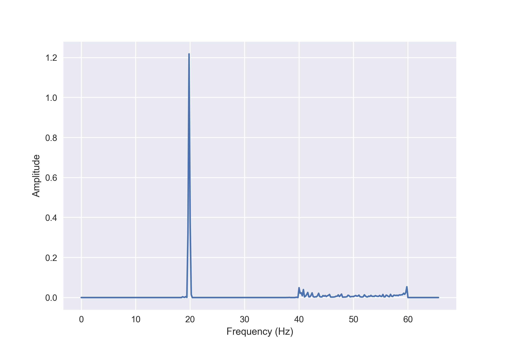

# hhtpy

An Empirical Mode Decomposition (EMD) implementation in Python.

## Overview

**hhtpy** is a Python library for performing Empirical Mode Decomposition (EMD) on one-dimensional signals. EMD is a key
part of the Hilbert-Huang Transform (HHT), which is used for analyzing nonlinear and non-stationary time series data.

This library was written by **Lars Havstad** and **Geir Kulia**.

## Installation

You can install **hhtpy** using `pip`:

```bash
pip install hhtpy
```

*Note: Replace the installation instructions with the actual method if the package is not available on PyPI.*

## Usage

Here's a basic example of how to use **hhtpy** to perform EMD on a signal:

```python
import numpy as np
import matplotlib.pyplot as plt
from hhtpy import hilbert_huang_transform
from hhtpy.plot import plot_imfs, plot_hilbert_spectrum


T = 5  # sec
f_s = 15000  # Hz
n = np.arange(T * f_s)
t = n / f_s  # sec

y = 1 * np.cos(2 * np.pi * 50 * t + 20 * np.sin(2 * np.pi * 0.5 * t)) + 2 * np.cos(
    2 * np.pi * 20 * t
)

imfs, residue = hilbert_huang_transform(y, f_s)

fig, axs = plot_imfs(imfs, y, residue, t, max_number_of_imfs=2)
```

```python
fig, ax, clb = plot_hilbert_spectrum(
    imfs,
    max_number_of_imfs=2,
)
```


```python
fig, ax = plot_marginal_hilbert_spectrum(imfs)
```


### Custom Stopping Criterion

You can provide a custom stopping criterion function to control the sifting process. The function should accept the
current mode and total sifts performed as input and return a boolean indicating whether to stop sifting (`True`) or continue (`False`).

```python
def custom_stopping_criterion(mode: np.ndarray, total_sifts_performed:int) -> bool:
    # Your custom logic here
    return True  # or False
```

## Acknowledgements

We want to express our sincere gratitude to the following individuals for their invaluable contributions and support
throughout this project:

- **Professor Norden Huang**: For his extensive one-on-one lectures over ten days, during which he taught us the
  Hilbert-Huang Transform (HHT) and guided us through the nuances of implementing it. Many of the insights and
  implementation techniques used in this project directly result from these invaluable sessions.

- **Professor Marta Molinas**: To introduce us to the HHT methodology, provide foundational knowledge, and engage in
  valuable discussions about the implementation. Her guidance has been instrumental in shaping our understanding and
  approach.

- **Professor Olav B. Fosso**: For his numerous fruitful dialogues on improving and optimizing the algorithm. His
  insights have greatly influenced the refinement of our implementation.

- **Sumit Kumar Ram (@sumitram)**: For explaining the HHT algorithm to me for the first time. His clear and concise
  explanation provided the initial spark that fueled our deeper exploration of the method.

Thank you all for your expertise, time, and mentorship, which made this work possible.

## Contributing

Contributions are welcome! If you have suggestions for improvements or find any issues, please open an issue or submit a
pull request on the GitHub repository.
