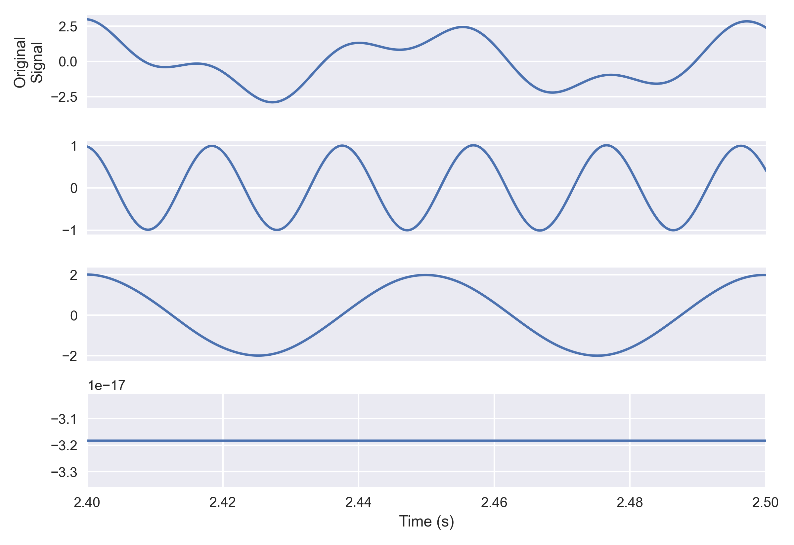

# hhtpy

An Empirical Mode Decomposition (EMD) implementation in Python.

## Overview

**hhtpy** is a Python library for performing Empirical Mode Decomposition (EMD) on one-dimensional signals. EMD is a key part of the Hilbert-Huang Transform (HHT), which is used for analyzing nonlinear and non-stationary time series data.

This library was written by **Lars Havstand** and **Geir Kulia**.

## Installation

You can install **hhtpy** using `pip`:

```bash
pip install hhtpy
```

*Note: Replace the installation instructions with the actual method if the package is not available on PyPI.*

## Usage

Here's a basic example of how to use **hhtpy** to perform EMD on a signal:

```python
import numpy as np
import matplotlib.pyplot as plt
from hhtpy import EmpiricalModeDecomposition
from hhtpy.plot import plot_imfs


T = 5  # sec
f_s = 15000  # Hz
n = np.arange(T * f_s)
t = n / f_s  # sec

y = (
        0.3 * np.cos(2 * np.pi * 5 * t ** 2) +
        2 * np.array(np.cos(2 * np.pi * 1 * t)) +
        1 * t
)

emd = EmpiricalModeDecomposition(y)
emd.decompose()

fig, axs = plot_imfs(emd.imfs, y, emd.residue, x_axis=t, show_plot=False)
axs[-1].set_xlabel('Time [s]')
axs[0].set_ylabel('Original\nSignal')
axs[0].set_xticks([])

for i in range(1, len(emd.imfs) + 1):
    axs[i].set_ylabel(f'IMF {i}')
    axs[i].set_xticks([])

axs[-1].set_ylabel('Residue')

plt.show()
```


## API Reference

### `EmpiricalModeDecomposition`

```python
class EmpiricalModeDecomposition:
    def __init__(
        self,
        signal: np.ndarray,
        stopping_criterion: Callable = None,
        max_sift_iterations: int = 11
    ):
        # Initialization code

    def decompose(self):
        # Perform the decomposition

    def set_stopping_criterion(self, stopping_criterion_func: Callable):
        # Set a custom stopping criterion function
```

#### Parameters

- **signal** (`np.ndarray`): The input signal to decompose. Must be a one-dimensional NumPy array.
- **stopping_criterion** (`Callable`, optional): A custom function to determine when to stop the sifting process for an IMF.
- **max_sift_iterations** (`int`, optional): The maximum number of sifting iterations allowed per IMF. Default is `11`.

#### Methods

- **`decompose()`**: Performs the EMD on the input signal, extracting IMFs and the residue.
- **`set_stopping_criterion(stopping_criterion_func)`**: Sets a custom stopping criterion function for the sifting process.

#### Attributes

- **`imfs`** (`List[np.ndarray]`): A list containing the extracted IMFs after decomposition.
- **`residue`** (`np.ndarray`): The final residue after extracting all IMFs.

## Custom Stopping Criterion

You can provide a custom stopping criterion function to control the sifting process. The function should accept the current mode as input and return a boolean indicating whether to stop sifting (`True`) or continue (`False`).

```python
def custom_stopping_criterion(mode: np.ndarray) -> bool:
    # Your custom logic here
    return True  # or False
```

Set the custom stopping criterion:

```python
emd.set_stopping_criterion(custom_stopping_criterion)
```

## Authors

- **Lars Havstand**
- **Geir Kulia**

## Acknowledgments

- This library is based on the principles of the Empirical Mode Decomposition algorithm used in signal processing.
- Special thanks to the contributors and the scientific community for their valuable insights.

## Contributing

Contributions are welcome! If you have suggestions for improvements or find any issues, please open an issue or submit a pull request on the GitHub repository.

## Contact

For any questions or inquiries, please contact:

- Lars Havstand: *[lars@sal.no](mailto:lars@sal.no)*
- Geir Kulia: *[geir@sal.no](mailto:geir@sal.no)*
